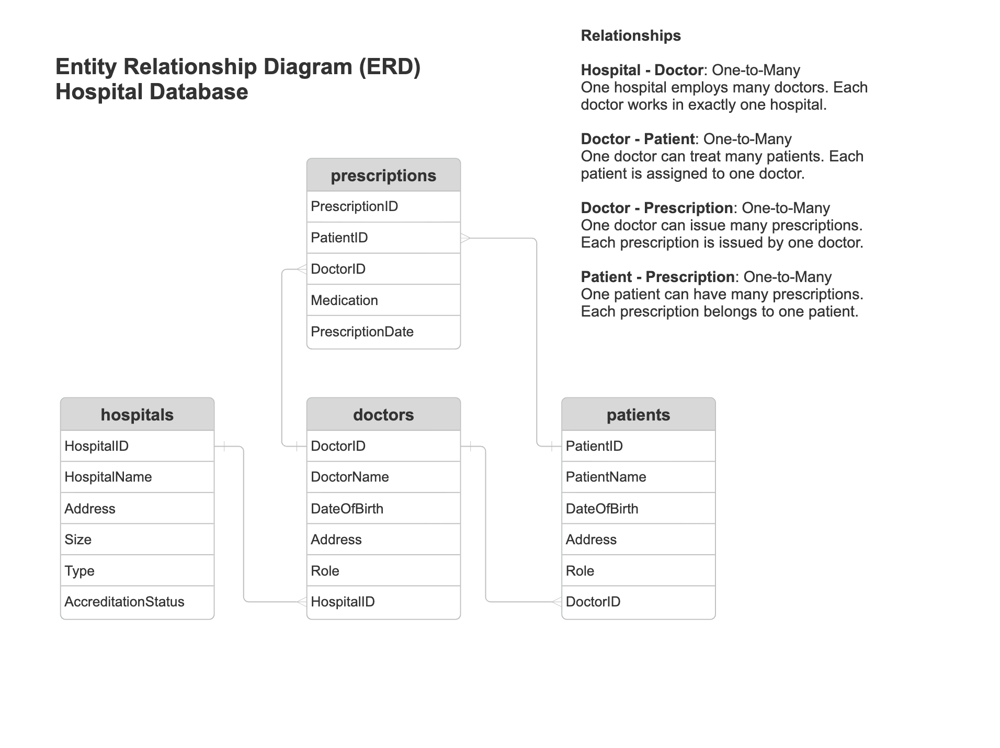

# About The Project
**Assessment 1 - Database Project**

This project contains a MySQL database for a hospital system, including tables for hospitals, doctors, patients, and prescriptions.  
The repository demonstrates database design, data import, and SQL queries to extract and analyse the data.

## Repository Contents

### **hospitals.sql**
  - MySQL database dump including table structures and imported data.
  Import this file into MySQL to recreate the complete hospital database used in ths project.

### **diagrams**  
  - **Flowchart database hospitals.png** – Flowchart illustrating the database design and data loading process
  - **ERD Database hospitals.png** – Entity Relationship Diagram showing tables and relationships
 
### **queries.sql**  
  - A collection of SQL queries that answer the assessment tasks.  
  Each query is commented to explain what it does and why it is used.
  Where appropriate, alternative approaches are shown (e.g. using 'WHERE' only and 'INNER JOIN').

## Data Import and Primary Key Handling

The CSV files (`hospitals.csv`, `doctors.csv`, `patients.csv`, `prescriptions.csv`) were imported into tables created without AUTO_INCREMENT on the *primary keys*. This ensured that the original ID values from the CSV files were preserved.
In particular, the `patients.csv` uses patient IDs starting from 101, while the other CSV files use IDs staring from 1. All IDs were therefore imported exactly as provided.

After the data import was completed, the *primary key* fields were modified to use `AUTO_INCREMENT` to supoort future insert without manually specifying *primary key* values. This was done using the following statement for each table:

```sql
ALTER TABLE table
MODIFY entity_id INT unsigned NOT NULL AUTO_INCREMENT;
```

This approach allows new records (e.g. new patients) to be added safely and helps prevent primary key conflicts in future inserts.

  
## Diagrams
The ERD shows all tables in the **hospital database** and their relationshps (`hospital-doctor`, `doctor-patient`, `patient-prescription`, `doctor-prescription`, etc.).

### Entity Relationship Diagram (ERD)



## Usuage

1. Import the `hospitals.sql`file into a MySQL database.
2. Open the file `queries.sql`, which contains all SQL gueries required for the assessment.
3. Run the queries individually. Each query is commented to explain which assessment task it addresses and what it demonstrates.


